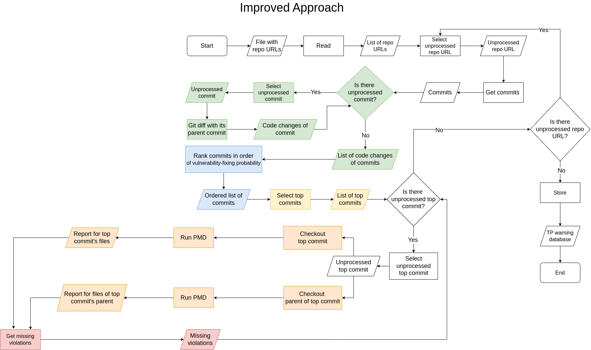

# Description
This tool can be used to mine true positive warnings in Java projects.
The simplified flowchart of the miner tool looks as follows: 

Note that, our approach based on [VulCurator: A Vulnerability-fixing Commit Detector](https://github.com/ntgiang71096/VFDetector). We use VulCurator to rank commits in order of vulnerability fixing probability.
Please, also note that this is a work-in-progress tool, and thus, false results may occur. It was tested on Linux and works, but may work on Windows as well. 

# Requirements

In order to use the miner tool, you need the following software installed:
- [Docker](https://docs.docker.com/get-docker/)
- [PMD](https://pmd.github.io/)
- [Python3](https://www.python.org/downloads/)

Moreover, you should install all the Python modules listed in [```requirements.txt```](./requirements.txt) as follows:
```
pip install -r requirements.txt
```

# Demo
After you have installed everything mentioned in [Requirements](#requirements),
you can test the miner tool on the following two demo projects.

## Dropwizard-jobs
It is a real life GitHub project, which you can find [here](https://github.com/dropwizard-jobs/dropwizard-jobs).
Note that the commit [c13f51d](https://github.com/dropwizard-jobs/dropwizard-jobs/commit/c13f51d) contains three true positive [ImmutableField (Java, Design)](https://docs.pmd-code.org/latest/pmd_rules_java_design.html#immutablefield) PMD warnings. 
In order to get these warnings, you should run the following command:
```
./pipeline --shm-size 32g --repo-list repo_dj.txt --since 2023-10-14 --until 2023-10-15
```
After the successful run of the miner tool, you can find the results in the file [```./warn_db/dropwizard-jobs/warn_db.csv```](./warn_db/dropwizard-jobs/warn_db.csv).
Note that, apart from the three aforementioned warnings, the result file may contain false results as well (*cf.* [Description](#description)).


## TestRepo
It is just a test project, which you can find [here](https://github.com/RustyPincer/TestRepo), and which contains several [MutableStaticState (Java, Design)](https://docs.pmd-code.org/latest/pmd_rules_java_design.html#mutablestaticstate) PMD warnings (*cf.* *e.g.* the commit [3d651da](https://github.com/RustyPincer/TestRepo/commit/3d651da857347555c2cfb26e5f855b3ec830980e)).
```
./pipeline --shm-size 32g --repo-list repo_test.txt
```
After the successful run of the miner tool, you can find the results in the file [```./warn_db/TestRepo/warn_db.csv```](./warn_db/TestRepo/warn_db.csv). 

# Usage
To run the miner tool on other projects, you should follow the next steps.
1. Create a file ```repo_list.txt``` containing the URLs of the repositories you would like to mine. Note that each URL should be separated by a new line character. (See the demo files [for project dropwizard-jobs](./repo_dj.txt) and [for project TestRepo](./repo_test.txt).)
2. Run the following command:
```
./pipeline --shm-size 32g --repo-list repo_list.txt
```
Note that, if you are interested in particular commits filtered by dates, then use arguments ```--since``` or ```--until``` (*cf.* [Dropwizard-jobs](#dropwizard-jobs)).
3. After the successful run, you can find the results in the directory [```./warn_db```](./warn_db).