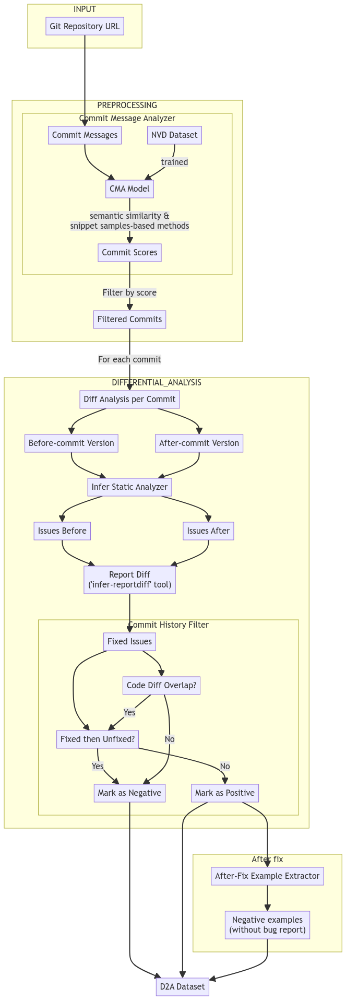
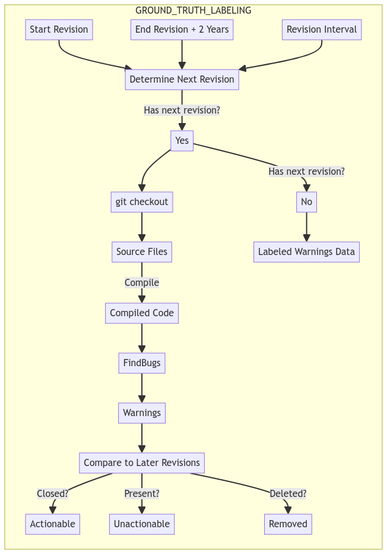

# FP dataset generation approaches

## [New Real-Word Dataset](https://ieeexplore.ieee.org/stamp/stamp.jsp?tp=&arnumber=9779763)

Dataset from publication in 2022, focusing on SonarQube FPs and TPs.

### Process

Detailed in *Section III.B.*

## [D2A](https://arxiv.org/abs/2102.07995)

Large c++ dataset from 2021 generated by IBM. 

### Process

Detailed under *Section III.*

### Projects 

Table IV in the publication details the dataset generation data per project.

* OpenSSL
* FFmpeg
* httpd
* NGINX
* libtiff
* libav

## [Golden Feature Set](https://dl.acm.org/doi/pdf/10.1145/3239235.3239523)

Dataset and proposed feature set from 2018 for Java.

### Process

Detailed under *Section V.II*

