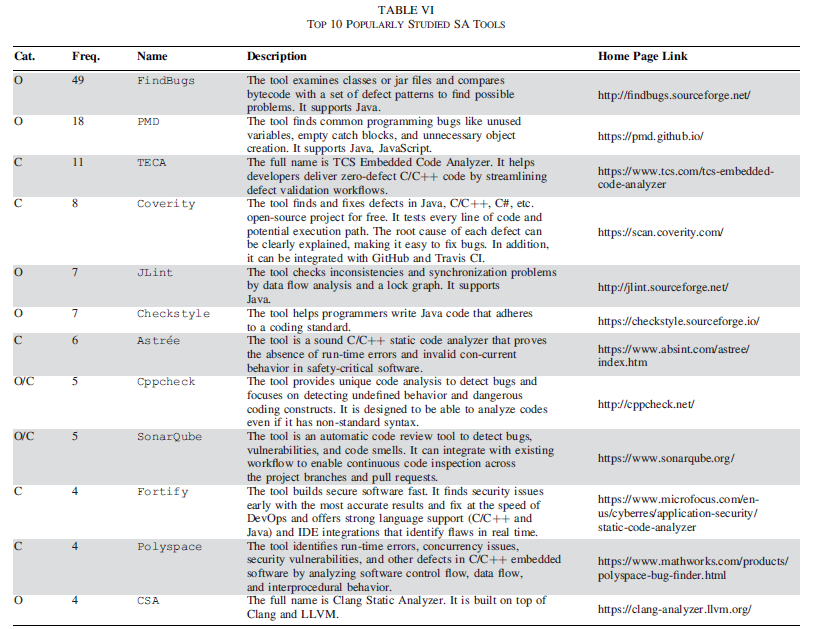

# Monthly FP Filtering summary

*4AI4Sec - April 2024*

## Reviewing related dataset generation processes

We've collected, reviewed and created sequence diagrams for the most promising and prevalent methods: New Real-Word dataset, D2A and Golden Feature set. See the flowcharts in `db_generation.md`

As a result, we decided to implement and improve upon IBM's D2A method and incorporate good ideas from the other two.

## Reviewing SA tools

We've collected, reviewed and benchmarked SA tools to generate new/more SA warnings. The considered tools are:

* SpotBugs
* SonarQube
* PMD
* Checkstyle

After some preliminary test runs we decided that Checkstyle doesn't generate relevant warnings for us, so we excluded it from further consideration.

### In literature

We looked up and found data regarding the usage of SA tools in FP Filtering. 

*Table is from [Mitigating false positive static analysis warnings: Progress, challenges, and opportunities](https://www.computer.org/csdl/journal/ts/2023/12/10305541/1RKAwH9PqkE)*  by Z. Guo et al.

Based on this, SpotBugs and PMD seem to be well used.

### Benchmarking

We compared the contenting models on a selected GitHub project to test their performance. The benchmarking details are available [here](https://docs.google.com/spreadsheets/d/1g4YcDP2r0gDnpzm2ti8qRZNTMbEfxtcPuKzeNqPjA7A/edit#gid=1840604375).

## Running and adjusting SLab's tool

We set up and test SLab's warning detector tool written in Python. The input of this detector tool is a list containing GitHub projects' URLs delimited by new line characters, and the output is a database of true positive warnings occurring in the projects. To find such true positives, the tool uses Maven for compiling and SpotBugs for analysis purposes. 

By default, the detector tool considers every possible commit pairs in each project. Of course, this would require a huge amount of processing time. Since we wish to collect only fresh warnings, we modified the detector tool, so now we are able to filter the commits by date, and hence, reduce the processing time a bit.

Furthermore, to see the true potential of the tool, we have acquired a computer with 16 CPU cores and 128 GB RAM, and installed it on that computer. We plan to utilize it for analyzing open-source GitHub projects. For further details, please, see the last section of this document. 

**!TODO**

## Finding bug/vulnerability fixing tools

To accommodate the process from D2A (which is based on bug-fixing commits) and reduce the workload of the SLab's tool (cf. the previous section), we looked for ways to find/prioritize commits with respect to their probability of being bug fixing. 

We found a good candidate model that seem to be used by the community: [VFDetector](https://github.com/ntgiang71096/VFDetector). We set it up tested it and and modified so that it can be used on machines without CUDA supported GPU. 

We've also looked at [Prospector](https://sap.github.io/project-kb/prospector/), but it is too specific for our use-case (it checks for specific vulnerabilities, while we need a general approach).

## Finding good quality GitHub projects

We plan to run SA tools on various projects, however for our results to be reliable we need good quality ones. We have collected and are actively collecting repos that:

* Have decent amount of stars
* Are actively maintained
* Written in Java
* Can be compiled using maven - this is assessed manually

Our progress can be seen [here](https://docs.google.com/spreadsheets/d/1g4YcDP2r0gDnpzm2ti8qRZNTMbEfxtcPuKzeNqPjA7A/edit#gid=1052988942).